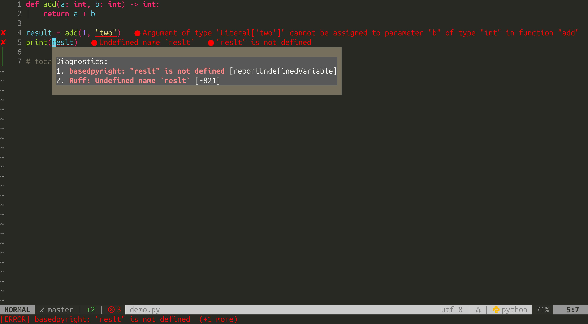
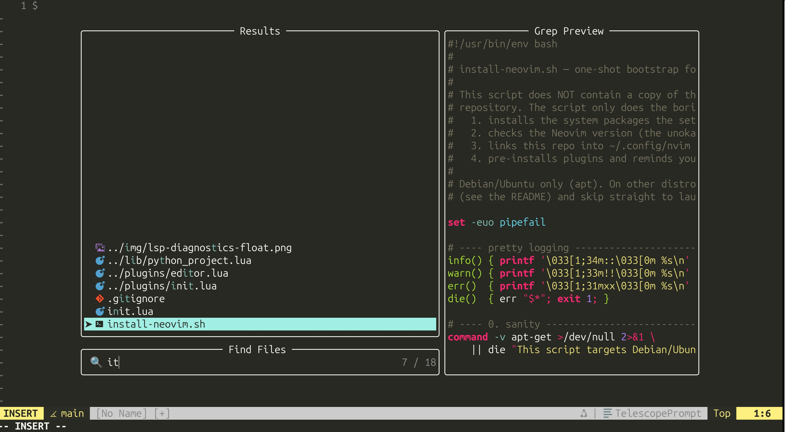
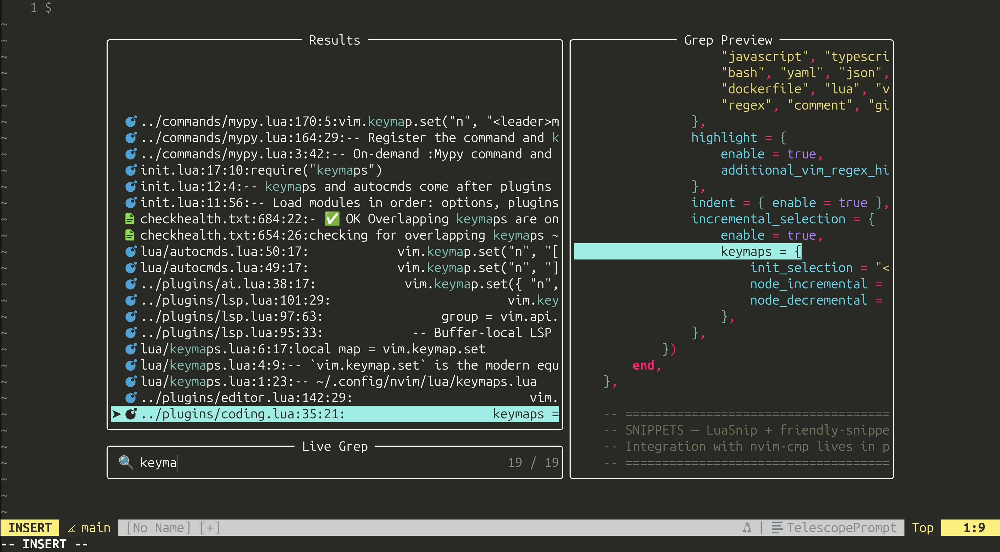
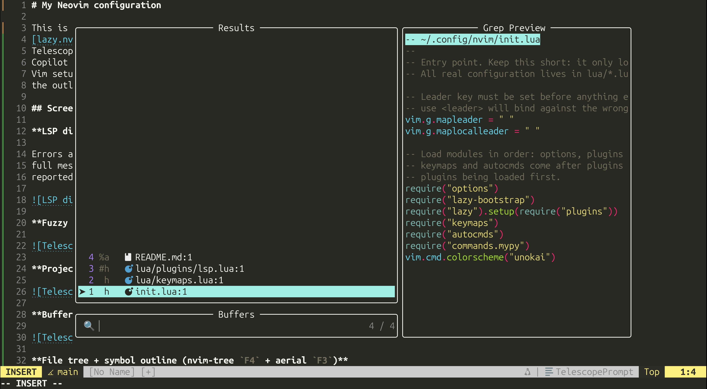
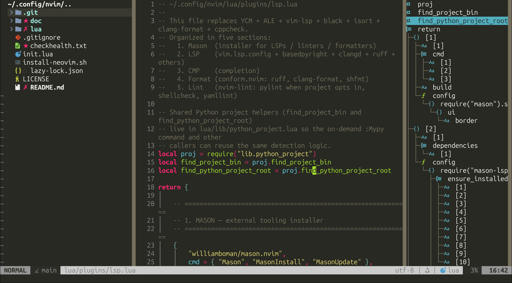
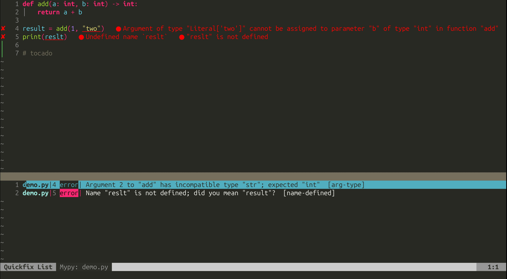
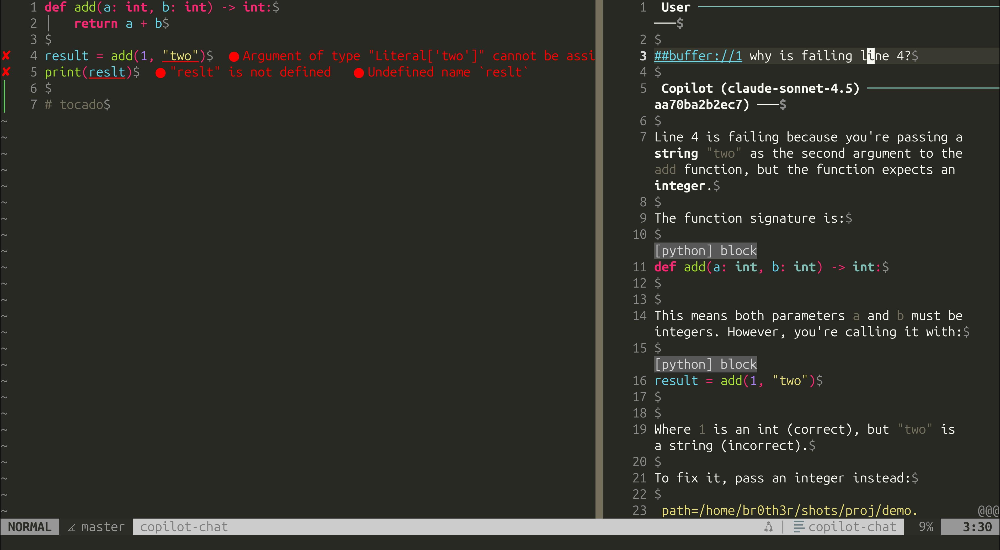
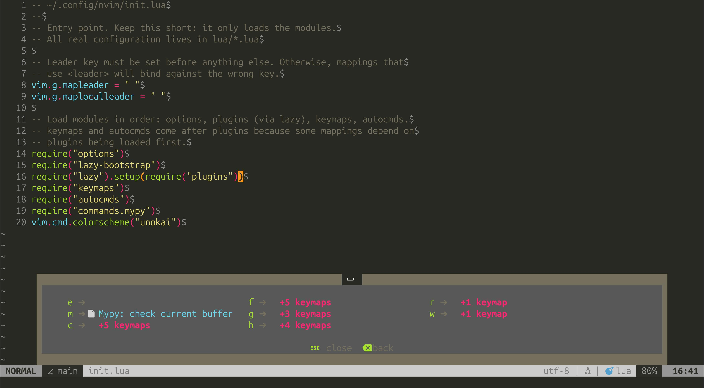

# My Neovim configuration

This is my daily-driver Neovim setup: a Lua configuration built around
[lazy.nvim](https://github.com/folke/lazy.nvim), native LSP, Treesitter and
Telescope, with a Python-first workflow (basedpyright + Ruff + mypy) and GitHub
Copilot integrated for AI assistance. It keeps the muscle memory of a classic
Vim setup (Enter to jump to a definition, `<C-p>` to open files, `F3`/`F4` for
the outline and the file tree) while giving you a modern IDE-like experience.

## Screenshots

**LSP diagnostics — basedpyright + Ruff, inline and in a float**

Errors and warnings appear inline as you type; press `<leader>e` to open the
full message in a floating window, showing which server (and which rule)
reported each one.

**Fuzzy file finder (Telescope, `<C-p>`)**

**Project-wide live grep (Telescope, `<leader>fg`)**

**Buffer switcher (Telescope, `Alt+Up`)**

**File tree + symbol outline (nvim-tree `F4` + aerial `F3`)**

**On-demand mypy into the quickfix list (`<leader>m`)**

**Copilot Chat (`<leader>cc`)**

**Keybinding discovery with which-key (press `<leader>` and wait)**

## Requirements

- **Neovim >= 0.10** — the config uses the builtin `unokai` colorscheme, which
  only exists from 0.10 onwards. On Ubuntu 24.04 the apt package may be older;
  use the [Neovim PPA](https://launchpad.net/~neovim-ppa/+archive/ubuntu/unstable)
  (`ppa:neovim-ppa/unstable`) to get a recent build.
- **git**, **make**, **gcc** — to clone plugins and build `telescope-fzf-native`.
- **Node.js + npm** — required by GitHub Copilot.
- **ripgrep** — Telescope live grep.
- **fd** — Telescope file finding (on Debian/Ubuntu the binary is `fdfind`; the
  install script bridges it to `fd`).
- **A Nerd Font** — for the icons in the statusline, file tree and outline.
  Install one (e.g. *FiraCode Nerd Font*) and select it in your terminal.

LSP servers, formatters and linters are **not** system packages: Mason installs
them automatically on first launch (see below).

## Installation

Back up any existing Neovim config first:

    mv ~/.config/nvim ~/.config/nvim.backup 2>/dev/null || true

Then:

1. Clone this repository straight into your config directory:

   `git clone https://github.com/juanmitaboada/nvim ~/.config/nvim`

2. Run the bootstrap script. On Debian/Ubuntu it installs the system packages
   listed above, checks your Neovim version, and pre-syncs the plugins:

   `~/.config/nvim/install-neovim.sh`

   (On other distros, install the same packages by hand and skip this step.)

3. Launch Neovim. Mason installs the LSP servers, formatters and linters on
   this first run — watch progress with `:Mason`:

   `nvim`

4. Authenticate Copilot (first time only):

   `:Copilot setup`

5. You are ready to go. Run `:checkhealth` anytime to verify everything.

## Shortcuts

`<leader>` is the **space bar**. These are the everyday shortcuts; there are a
few more in the config files.

| Shortcut            | Description                                                | Provided by  |
|:-------------------:|:-----------------------------------------------------------|:------------:|
| `*` / `#`           | Search word under the cursor forward / backward            | vim          |
| `n` / `N`           | Repeat search next / previous                              | vim          |
| `<C-p>`             | Open files (fuzzy finder)                                  | Telescope    |
| `<leader>ff`        | Find files                                                 | Telescope    |
| `<leader>fg`        | Live grep across the project (replaces `:Ack`)            | Telescope    |
| `<leader>fb` / `Alt+Up` | Switch between open buffers                            | Telescope    |
| `<leader>fh`        | Search the help                                            | Telescope    |
| `<leader>fr`        | Resume the last Telescope search                          | Telescope    |
| `Alt+Right` / `Alt+Left` | Next / previous buffer                                | vim          |
| `Alt+Down`          | Close current buffer                                       | vim          |
| `F3`                | Toggle the symbol outline                                  | aerial       |
| `F4`                | Toggle the file tree                                       | nvim-tree    |
| `F8`                | Save the session in the current folder                    | vim          |
| `Enter`             | Go to definition of the symbol under the cursor           | LSP          |
| `Backspace`         | Jump back (pop the tag stack)                              | vim          |
| `gd` / `gD`         | Go to definition / declaration                            | LSP          |
| `gr`                | List references                                            | LSP          |
| `gi`                | Go to implementation                                       | LSP          |
| `K`                 | Hover documentation                                       | LSP          |
| `<leader>rn`        | Rename symbol                                              | LSP          |
| `<leader>ca`        | Code action                                               | LSP          |
| `<leader>ws`        | Search workspace symbols                                   | LSP          |
| `]d` / `[d`         | Next / previous diagnostic                                | LSP          |
| `<leader>e`         | Show the diagnostic under the cursor in a float           | LSP          |
| `<leader>m`         | Run mypy on the current buffer (results to quickfix)      | mypy.lua     |
| `<leader>gs`        | Git status                                                 | fugitive     |
| `<leader>gb`        | Git blame                                                  | fugitive     |
| `<leader>gd`        | Git diff (split)                                           | fugitive     |
| `Tab`               | Accept the inline Copilot suggestion                      | Copilot      |
| `F12`               | Open the Copilot panel with alternatives                  | Copilot      |
| `<leader>cc`        | Open Copilot Chat                                          | CopilotChat  |
| `<leader>ce`        | Explain the selection / buffer                            | CopilotChat  |
| `<leader>cr`        | Review the selection (visual mode)                        | CopilotChat  |
| `<leader>cf`        | Suggest a fix for the selection (visual mode)             | CopilotChat  |
| `<C-Up>` / `<C-Down>` | Move the current line / block up / down                 | vim          |
| `<C-Left>` / `<C-Right>` | Unindent / indent the current line / block            | vim          |
| `<C-j>`             | Reformat the buffer as JSON (`python -m json.tool`)      | vim          |
| `F2`                | Expand the snippet under the cursor (insert mode)         | LuaSnip      |
| `<C-b>` / `<C-z>`   | Jump forward / backward between snippet placeholders     | LuaSnip      |

## Snippets

Snippets are powered by [LuaSnip](https://github.com/L3MON4D3/LuaSnip) with the
[friendly-snippets](https://github.com/rafamadriz/friendly-snippets) collection,
so the usual triggers for many languages are available out of the box. In
Python, for example, type a trigger such as `def`, `class`, `for`, `while`,
`with`, `try` or `ifmain` and press `F2` to expand it, then use `<C-b>` / `<C-z>`
to jump between the placeholders.

## AI assistance (Copilot)

Inline suggestions from GitHub Copilot appear automatically while typing; press
`Tab` to accept one, or `F12` to open the panel with several alternatives. Run
`:Copilot setup` once to authenticate.

For a conversation about your code, open Copilot Chat with `<leader>cc`. Note
that the chat does **not** see your code unless you hand it some context:

- Add `#buffer` at the start of your message to include the whole current file,
  e.g. `#buffer why does line 4 fail?`.
- Or make a visual selection first and use `<leader>ce` (explain), `<leader>cf`
  (suggest a fix) or `<leader>cr` (review) — these act on the selection.

Without one of those, Copilot will only ask you to paste the relevant code.

## Per-project linting (pylint) and type checking (mypy)

To keep noise down, pylint and mypy are **opt-in per project** instead of
running everywhere:

- **pylint** runs through `nvim-lint` only when the project provides its own
  configuration (e.g. a `.pylintrc`), using the project's virtualenv when one is
  detected.
- **mypy** never runs automatically. Run it on demand with `<leader>m` (or the
  `:Mypy` command) on the current Python buffer; results land in the quickfix
  list, where `Enter` jumps to each error.

## Plugins in use

| Plugin | Description |
|:------|:------------|
| [lazy.nvim](https://github.com/folke/lazy.nvim) | Plugin manager (bootstrapped automatically) |
| [nvim-lspconfig](https://github.com/neovim/nvim-lspconfig) | Configuration for the native LSP client |
| [mason.nvim](https://github.com/williamboman/mason.nvim) | Installer for LSP servers, formatters and linters |
| [mason-lspconfig](https://github.com/williamboman/mason-lspconfig.nvim) | Bridges Mason and lspconfig |
| [mason-tool-installer](https://github.com/WhoIsSethDaniel/mason-tool-installer.nvim) | Auto-installs the configured tools |
| [nvim-cmp](https://github.com/hrsh7th/nvim-cmp) | Completion engine (with LSP, buffer, path and snippet sources) |
| [LuaSnip](https://github.com/L3MON4D3/LuaSnip) | Snippet engine |
| [friendly-snippets](https://github.com/rafamadriz/friendly-snippets) | Ready-made snippet collection for many languages |
| [copilot.vim](https://github.com/github/copilot.vim) | GitHub Copilot inline suggestions |
| [CopilotChat.nvim](https://github.com/CopilotC-Nvim/CopilotChat.nvim) | Conversational Copilot inside Neovim |
| [telescope.nvim](https://github.com/nvim-telescope/telescope.nvim) | Fuzzy finder for files, grep, buffers, symbols and more |
| [telescope-fzf-native](https://github.com/nvim-telescope/telescope-fzf-native.nvim) | Native fzf sorter for Telescope |
| [plenary.nvim](https://github.com/nvim-lua/plenary.nvim) | Lua utility library used by several plugins |
| [nvim-tree.lua](https://github.com/nvim-tree/nvim-tree.lua) | File system explorer |
| [aerial.nvim](https://github.com/stevearc/aerial.nvim) | Symbol outline / code structure view |
| [lualine.nvim](https://github.com/nvim-lualine/lualine.nvim) | Statusline |
| [nvim-web-devicons](https://github.com/nvim-tree/nvim-web-devicons) | File-type icons (needs a Nerd Font) |
| [gitsigns.nvim](https://github.com/lewis6991/gitsigns.nvim) | Git change signs in the gutter |
| [vim-fugitive](https://github.com/tpope/vim-fugitive) | Git commands from inside Neovim |
| [nvim-treesitter](https://github.com/nvim-treesitter/nvim-treesitter) | Syntax highlighting and parsing |
| [indent-blankline](https://github.com/lukas-reineke/indent-blankline.nvim) | Indentation guides |
| [conform.nvim](https://github.com/stevearc/conform.nvim) | Formatting (black, shfmt, …) |
| [nvim-lint](https://github.com/mfussenegger/nvim-lint) | Linting (pylint, shellcheck, yamllint, …) |
| [nvim-autopairs](https://github.com/windwp/nvim-autopairs) | Automatic closing of quotes, brackets, etc. |
| [vim-commentary](https://github.com/tpope/vim-commentary) | Comment / uncomment lines and blocks |
| [vim-surround](https://github.com/tpope/vim-surround) | Add, change and delete surrounding pairs |
| [vim-repeat](https://github.com/tpope/vim-repeat) | Makes `.` repeat supported plugin maps |
| [vim-unimpaired](https://github.com/tpope/vim-unimpaired) | Handy bracket mappings (`[`, `]`) |
| [which-key.nvim](https://github.com/folke/which-key.nvim) | Popup that shows the available keybindings |

## Language servers and tools

Installed automatically by Mason on first launch:

- **LSP servers:** basedpyright, ruff, clangd, rust_analyzer, zls, bashls,
  yamlls, lua_ls, marksman, dockerls.
- **Formatters / linters:** black, mypy, shfmt, pylint, shellcheck, yamllint,
  hadolint.

## Author

[Juanmi Taboada](https://juanmitaboada.com/)
